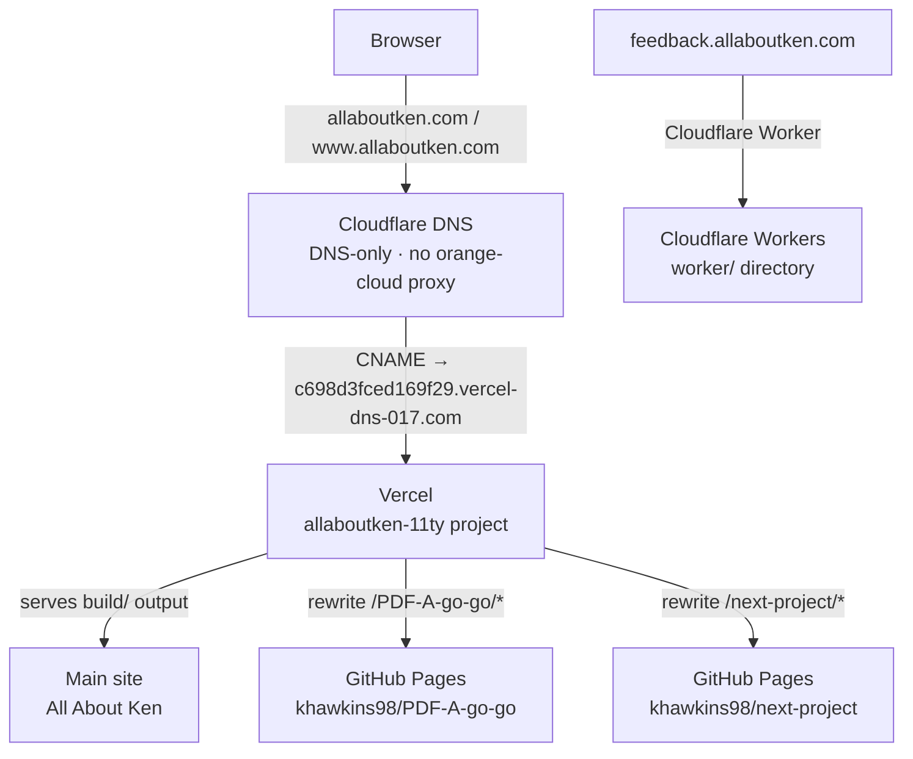

# Deployment architecture

This is the source of truth for how `allaboutken.com` is built, served, and extended with hobby projects. **Keep this file up to date** whenever DNS, Vercel config, or the list of proxied projects changes.

---

## Request flow



---

## Components

### Vercel — main site

- **Project:** `allaboutken-11ty` under the `kens-projects-2b306b90` (Ken's projects) team
- **Dashboard:** https://vercel.com/kens-projects-2b306b90/allaboutken-11ty
- **Domains:** https://vercel.com/kens-projects-2b306b90/allaboutken-11ty/settings/domains
- **Usage (bandwidth):** https://vercel.com/kens-projects-2b306b90/~/usage
- **Deployment protection:** disabled — production URL is public
- **Auto-deploy:** Vercel GitHub App watches `main`; pushes trigger a new production build automatically
- **Build command:** `yarn build` (clean → sass → eleventy → embeddings)
- **Output directory:** `build/`
- **Config file:** `vercel.json` in repo root

Vercel serves the compiled site and reverse-proxies specific path prefixes to GitHub Pages hobby projects (see Rewrites below). Proxied bytes count against the **100 GB/month Hobby plan bandwidth cap** — if exceeded, the site goes dark until the next billing cycle with no overage option. Check usage before adding high-traffic projects.

### Cloudflare DNS

- **Zone:** `allaboutken.com`
- **Dashboard:** https://dash.cloudflare.com (Domains → allaboutken.com → DNS)

Current DNS records for the main site:

| Type  | Name            | Content                                   | Proxy    |
|-------|-----------------|-------------------------------------------|----------|
| TXT   | `_vercel`       | `vc-domain-verify=allaboutken.com,…`     | DNS only |
| CNAME | `allaboutken.com` | `c698d3fced169f29.vercel-dns-017.com`   | DNS only |
| CNAME | `www`           | `cname.vercel-dns.com`                    | DNS only |

> **Important:** These records must be set to **DNS only** (grey cloud), not proxied (orange cloud). Cloudflare proxying in front of Vercel causes certificate and routing issues.

`allaboutken.com` 307-redirects to `www.allaboutken.com` — this is handled by Vercel, not Cloudflare.

### Cloudflare Worker — feedback

- **Subdomain:** `feedback.allaboutken.com`
- **Source:** `worker/` directory in this repo
- **Deploy:** manually via `cd worker && npx wrangler deploy` (auto-deploy CI is currently broken — see `.github/workflows/deploy-feedback-worker.yml` for details)
- Completely independent of the main site serving. Not affected by Vercel or DNS changes to the apex domain.

### GitHub Pages — main site (warm spare) and hobby project origins

- **URL:** `khawkins98.github.io`

**Main site:** GitHub Actions (`.github/workflows/build-and-deploy.yml`) still builds and deploys the main site to GitHub Pages on every push to `main`. This is currently a warm spare — `allaboutken.com` DNS now points to Vercel, so GitHub Pages is not receiving production traffic. See issue #62 for the planned cleanup.

**Hobby projects: do not disable GitHub Pages in these repos.** Each hobby project has its own repo with its own GitHub Pages deployment, and Vercel proxies to `khawkins98.github.io/project-name/` as the origin. If GitHub Pages is turned off in a hobby project repo, the proxied path on `allaboutken.com` will immediately 404. When adding a new hobby project, confirm GitHub Pages is enabled and the site is live at `khawkins98.github.io/repo-name/` *before* adding the rewrite to `vercel.json`.

---

## Rewrites (proxied hobby projects)

Defined in `vercel.json`. Trailing-slash and no-slash root requests are redirected to the explicit `/index.html` path (which fires before Vercel's filesystem check), then the rewrite proxies all sub-paths to GitHub Pages. The project's own repo and build pipeline are unchanged.

**Routing for each project works as follows:**
- `allaboutken.com/project-name/` → 307 redirect → `allaboutken.com/project-name/index.html`
- `allaboutken.com/project-name` → 307 redirect → `allaboutken.com/project-name/index.html`
- `allaboutken.com/project-name/index.html` → rewrite → `https://khawkins98.github.io/project-name/index.html`
- `allaboutken.com/project-name/anything` → rewrite → `https://khawkins98.github.io/project-name/anything`

The redirect-to-index-html approach is necessary because Vercel's directory-index check intercepts trailing-slash requests before any rewrite rule can run.

| Path prefix | GitHub Pages origin | Repo |
|-------------|---------------------|------|
| `/PDF-A-go-go/` | `https://khawkins98.github.io/PDF-A-go-go/` | [khawkins98/PDF-A-go-go](https://github.com/khawkins98/PDF-A-go-go) |

---

## How to add a new proxied project

1. **Confirm GitHub Pages is live in the hobby project repo.** Go to the repo Settings → Pages and verify it's enabled and serving at `khawkins98.github.io/repo-name/`. Vercel proxies to GitHub Pages as the origin — if GH Pages is off, the proxied path will 404. **Never disable GitHub Pages in a hobby project repo** once it's been added as a rewrite.

2. **Check the project's asset paths.** Assets must use either relative `./` paths or paths prefixed with the repo name (e.g. `/my-project/foo.css`). Bare root-relative paths like `/foo.css` will break — Vercel serves them from the main site root. `./`-style relative paths work fine: because the browser URL ends with `/project-name/index.html`, `./` resolves to `/project-name/` as expected.

2. **Check if it's a SPA.** Single-page apps that use client-side routing need a `404.html` that loads `index.html` on GitHub Pages, so that deep links work through the proxy. If the project has a `404.html` already that redirects to `index.html`, you're good.

3. **Add redirects and a rewrite to `vercel.json`:**

   ```json
   "redirects": [
     { "source": "/my-project",  "destination": "/my-project/index.html", "permanent": false },
     { "source": "/my-project/", "destination": "/my-project/index.html", "permanent": false }
   ],
   "rewrites": [
     { "source": "/my-project/:path*", "destination": "https://khawkins98.github.io/my-project/:path*" }
   ]
   ```

   The two redirects are required because Vercel's directory-index check intercepts trailing-slash requests before any rewrite rule can fire. Redirects run before that check, so redirecting to the explicit `index.html` file lets the rewrite pick it up normally.

4. **Add a row to the Rewrites table** in this file.

5. **Commit and push.** Vercel will deploy automatically. Smoke-test `allaboutken.com/my-project/` once the deployment completes.

6. **Optionally update the project's README** to note the canonical URL is now `allaboutken.com/my-project/`.

---

## How to revert to GitHub Pages (remove Vercel from the chain)

If Vercel needs to be removed:

1. **Update Cloudflare DNS** — restore the A record pointing to GitHub Pages IPs and remove the Vercel CNAME/TXT records:

   | Type | Name              | Content         | Proxy    |
   |------|-------------------|-----------------|----------|
   | A    | `allaboutken.com` | `185.199.108.153` | Proxied |
   | A    | `allaboutken.com` | `185.199.109.153` | Proxied |
   | A    | `allaboutken.com` | `185.199.110.153` | Proxied |
   | A    | `allaboutken.com` | `185.199.111.153` | Proxied |
   | CNAME | `www`            | `khawkins98.github.io` | Proxied |

   Remove the `_vercel` TXT record and the Vercel CNAME.

2. **Re-enable the GitHub Pages custom domain** — go to the repo Settings → Pages and confirm `allaboutken.com` is set as the custom domain (GitHub Pages generates a `CNAME` file in the repo if configured via the UI; alternatively keep it in the `build/` output).

3. **Hobby project URLs will break** — the `/project-name/` paths only work via Vercel rewrites. If reverting, either leave those projects on `khawkins98.github.io/project-name/` or set up Cloudflare Page Rules/Workers to handle the proxying instead.

---

## CI/CD summary

| Trigger | What happens |
|---------|-------------|
| Push to `main` (source files changed) | GitHub Actions builds and deploys to GitHub Pages; Vercel GitHub App independently builds and deploys to Vercel production |
| Pull request | GitHub Actions runs a build check; Vercel creates a preview deployment |
| Manual `workflow_dispatch` | Can trigger either workflow manually from the Actions tab |

The GitHub Pages deploy in CI is currently a warm spare. Consider removing the `deploy` job from `.github/workflows/build-and-deploy.yml` once confidence in Vercel is established.
